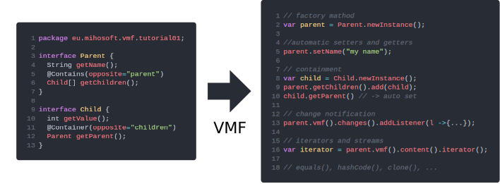

VMF
=======

[](https://www.javadoc.io/doc/eu.mihosoft.vmf/vmf) [](https://www.javadoc.io/doc/eu.mihosoft.vmf/vmf-runtime)

[](https://gitter.im/VMF_/Lobby?utm_source=badge&utm_medium=badge&utm_campaign=pr-badge&utm_content=badge)
<a href="https://foojay.io/today/works-with-openjdk">
   
</a>

<br>


VMF is a lightweight modeling framework. It conveniently translates annotated Java interfaces into powerful implementations. It writes all the inevitable but boring boilerplate code for you and provides a modern and stable API. It is designed to work with the newest versions of Java as soon as they are released. It works well with Java 11-17.
It generates/supports:

- getters and setters
- default values
- containment
- builder API
- equals() and hashCode()
- deep and shallow cloning
- change notification
- undo/redo
- object graph traversal API via iterators and streams
- immutable types and read-only wrappers
- delegation
- annotations
- reflection
- ...

A VMF model consists of annotated Java interfaces. We could call this "wannabe" code. Just specify the interface and its properties and get a fully functional  implementation including property setters and getters, builders, iterators, and much more. Even for a simple model VMF provides a lot of useful APIs:



## Using VMF

Checkout the tutorial projects: https://github.com/miho/VMF-Tutorials

VMF comes with excellent Gradle support. Just add the plugin like so (get the latest version [here](https://plugins.gradle.org/plugin/eu.mihosoft.vmf)):

```gradle
plugins {
  id "eu.mihosoft.vmf" version "0.2.8.1" // use latest version
}
```

Now just add the model definitions to the VMF source folder, e.g., `src/main/vmf/`. The package name must end with `.vmfmodel`, for example:

```java
package eu.mihosoft.vmf.tutorial.vmfmodel;

import eu.mihosoft.vmf.core.Container;
import eu.mihosoft.vmf.core.Contains;

interface Parent {

    @Contains(opposite = "parent")
    Child[] getChildren();

    String getName();
}

interface Child {
    @Container(opposite="children")
    Parent getParent();
    
    int getValue();
}
```

Just call the `vmfGenModelSources` task to generate the implementation.

To improve IDE support, enable the IntelliJ support via

```
buildscript {
  ext.vmfPluginIntelliJIntegration = true
}
```

## Building VMF (Core)

### Requirements

- Java >= 11
- Internet connection (dependencies are downloaded automatically)
- IDE: [Gradle](http://www.gradle.org/) Plugin (not necessary for command line usage)

### IDE

Open the `VMF` core [Gradle](http://www.gradle.org/) project in your favourite IDE (tested with IntelliJ 2021) and build it
by calling the `publishToMavenLocal` task.

### Command Line

Navigate to the `VMF` core [Gradle](http://www.gradle.org/) project (i.e., `path/to/VMF/core`) and enter the following command

#### Bash (Linux/macOS/Cygwin/other Unix shell)

    bash gradlew publishToMavenLocal
    
#### Windows (CMD)

    gradlew publishToMavenLocal
    
## Building VMF (Runtime)

### IDE

Open the `VMF` runtime [Gradle](http://www.gradle.org/) project in your favourite IDE (tested with IntelliJ 2020) and build it
by calling the `publishToMavenLocal` task.

### Command Line

Navigate to the `VMF` runtime [Gradle](http://www.gradle.org/) project (i.e., `path/to/VMF/runtime`) and enter the following command

#### Bash (Linux/macOS/Cygwin/other Unix shell)

    bash gradlew publishToMavenLocal
    
#### Windows (CMD)

    gradlew publishToMavenLocal    
    
## Building VMF (Gradle Plugin)

### IDE

Open the `VMF` [Gradle](http://www.gradle.org/) plugin project in your favourite IDE (tested with IntelliJ 2021) and build it
by calling the `publishToMavenLocal` task.

### Command Line

Navigate to the `VMF` runtime [Gradle](http://www.gradle.org/) project (i.e., `path/to/VMF/gradle-project`) and enter the following command

#### Bash (Linux/macOS/Cygwin/other Unix shell)

    bash gradlew publishToMavenLocal
    
#### Windows (CMD)

    gradlew publishToMavenLocal 

## Testing VMF (Core, Runtime & Plugin)

To execute the test suite, navigate to the test project (i.e., `path/to/VMF/test-suite`) and enter the following command

#### Bash (Linux/macOS/Cygwin/other Unix shell)

    bash gradlew test
    
#### Windows (CMD)

    gradlew test

This will use the latest snapshot vmf and gradle-plugin to execute the tests defined in the test-suite project.

### Viewing the Report

An HTML version of the test report is located in the build folder `test-suite/build/reports/tests/test/index.html`.
